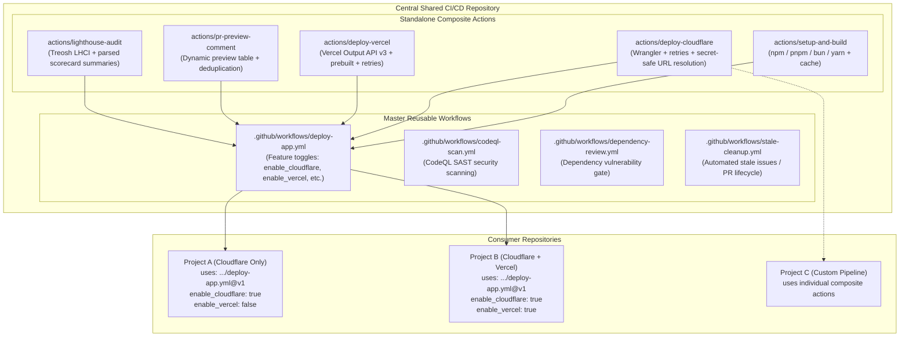

# Shared CI/CD Framework

A production-grade, modular CI/CD framework for web applications. Built with a **Hybrid Architecture** combining:
1. **Composable Actions**: Independent building blocks for runtime setup, multi-cloud deployments, PR feedback, and performance audits.
2. **Reusable Workflows**: Complete out-of-the-box pipelines that downstream projects can adopt with a 15-line workflow file.

---

## Architecture Overview



---

## Quickstart

### 1. Pure Static / Zero-Dependency Site (Vanilla HTML/CSS/JS)
**Zero configuration required!** No `package.json` or build scripts needed. The workflow auto-detects static repositories, bypasses dependency installation and build steps, stages static assets, and deploys immediately:

```yaml
name: CI/CD Pipeline

on:
  push:
    branches: [ "main" ]
  pull_request:
    branches: [ "main" ]
  workflow_dispatch:

concurrency:
  group: ${{ github.workflow }}-${{ github.ref }}
  cancel-in-progress: true

permissions:
  contents: read
  pull-requests: write
  deployments: write

jobs:
  deploy:
    uses: my-org/shared-ci-cd/.github/workflows/deploy-app.yml@v1
    with:
      enable_cloudflare: true
      cloudflare_project_name: 'my-static-site'
    secrets: inherit
```

---

### 2. Standard Framework Site on Cloudflare Pages
In your project repository, create `.github/workflows/ci-cd.yml`:

```yaml
name: CI/CD Pipeline

on:
  push:
    branches: [ "main" ]
  pull_request:
    branches: [ "main" ]
  workflow_dispatch:

concurrency:
  group: ${{ github.workflow }}-${{ github.ref }}
  cancel-in-progress: true

permissions:
  contents: read
  pull-requests: write
  deployments: write

jobs:
  deploy:
    uses: LABEIM/shared-ci-cd/.github/workflows/deploy-app.yml@v1
    with:
      node_version: '22'
      package_manager: 'npm' # npm | pnpm | bun | yarn | none
      build_command: 'npm run build'
      dist_dir: 'dist'
      enable_cloudflare: true
      cloudflare_project_name: 'my-web-app'
      enable_vercel: false # Vercel is disabled & uses 0 runner minutes
      lighthouse_routes: |
        /
        /about
        /contact
    secrets: inherit
```

---

### 3. Multi-Cloud Parallel Deployment (Cloudflare + Vercel Backup)
```yaml
jobs:
  deploy:
    uses: LABEIM/shared-ci-cd/.github/workflows/deploy-app.yml@v1
    with:
      node_version: '22'
      package_manager: 'pnpm'
      build_command: 'pnpm build'
      dist_dir: 'dist'

      # Both platforms deployed in parallel
      enable_cloudflare: true
      cloudflare_project_name: 'production-store'

      enable_vercel: true
      vercel_project_id: ${{ vars.VERCEL_PROJECT_ID }}
      vercel_org_id: ${{ vars.VERCEL_ORG_ID }}

      lighthouse_routes: |
        /
        /pricing
    secrets: inherit
```

---

### 4. Using Standalone Composite Actions Directly
If your project has custom Docker builds, staging environments, or multi-step release gates, import composite actions directly:

```yaml
jobs:
  custom-build:
    runs-on: ubuntu-latest
    steps:
      - uses: actions/checkout@v4
      
      - name: Build site
        uses: LABEIM/shared-ci-cd/actions/setup-and-build@v1
        with:
          package_manager: 'bun'
          build_command: 'bun run build'
          dist_dir: 'out'

      - name: Deploy to Cloudflare
        id: cf
        uses: LABEIM/shared-ci-cd/actions/deploy-cloudflare@v1
        with:
          project_name: 'my-custom-app'
          dist_dir: 'out'
          api_token: ${{ secrets.CLOUDFLARE_API_TOKEN }}
          account_id: ${{ secrets.CLOUDFLARE_ACCOUNT_ID }}

      - name: Post PR Comment
        if: github.event_name == 'pull_request'
        uses: LABEIM/shared-ci-cd/actions/pr-preview-comment@v1
        with:
          cloudflare_url: ${{ steps.cf.outputs.deploy_url }}
```

---

## Configuration Reference

### Reusable Workflow (`deploy-app.yml`)

#### Inputs (`with:`)

| Input | Type | Default | Description |
| :--- | :---: | :---: | :--- |
| `node_version` | String | `'22'` | Node.js version |
| `package_manager` | String | `'npm'` | Package manager (`npm`, `pnpm`, `bun`, `yarn`, `none`) |
| `install_command` | String | `''` | Custom install command override (or `'none'` to skip) |
| `check_command` | String | `''` | Optional diagnostic check (e.g. `npx astro check`, `npm run lint`) |
| `build_command` | String | `'npm run build'` | Static build command (or `'none'` for static/pre-built sites) |
| `dist_dir` | String | `'dist'` | Static export directory to deploy (`'dist'`, `'public'`, `'.'`, etc.) |
| `enable_cloudflare` | Boolean | `true` | Enable Cloudflare Pages deployment |
| `cloudflare_project_name` | String | `''` | Cloudflare Pages project name |
| `production_branch` | String | `'main'` | Production branch name |
| `enable_vercel` | Boolean | `false` | Enable Vercel parallel/backup deployment |
| `vercel_project_id` | String | `''` | Vercel Project ID |
| `vercel_org_id` | String | `''` | Vercel Organization ID or Team ID |
| `enable_pr_comment` | Boolean | `true` | Automatically post/update PR preview comments |
| `enable_lighthouse` | Boolean | `true` | Run automated Lighthouse CI performance audit |
| `lighthouse_routes` | String | `'/'` | Space or newline-separated list of relative paths |
| `lighthouse_config_path` | String | `''` | Optional custom `.lighthouserc.json` path |

#### Secrets (`secrets:`)

| Secret | Required | Description |
| :--- | :---: | :--- |
| `CLOUDFLARE_API_TOKEN` | If CF enabled | Cloudflare API token with `Account.Cloudflare Pages:Edit` permissions |
| `CLOUDFLARE_ACCOUNT_ID` | If CF enabled | Cloudflare Account ID (32-character hexadecimal string) |
| `VERCEL_TOKEN` | If Vercel enabled | Vercel personal access token or automation token |

---

## Organization & Repository Setup

### 1. Configure Organization Secrets
Store shared infrastructure tokens once at the GitHub Organization level:
* Go to **Organization Settings** -> **Secrets and variables** -> **Actions**.
* Add:
  - `CLOUDFLARE_API_TOKEN`
  - `CLOUDFLARE_ACCOUNT_ID`
  - `VERCEL_TOKEN`
* Set **Repository access** to `Selected repositories` or `All repositories`.

### 2. Enable Workflow Access (Private/Internal Repositories)
To allow other repositories in your GitHub Organization to call this workflow:
1. In this shared repository, navigate to **Settings** -> **Actions** -> **General**.
2. Under **Access**, select **Accessible from repositories in the '[your-org]' organization**.

### 3. Release & Versioning Strategy
* Consumer projects should reference major version tags (e.g. `@v1`):
  ```yaml
  uses: LABEIM/shared-ci-cd/.github/workflows/deploy-app.yml@v1
  ```
* For detailed step-by-step tag management and release instructions, see [RELEASING.md](RELEASING.md).

---

## Framework Recipes

### Pure Static / Vanilla HTML, CSS & JS (Zero Configuration)
* Automatically skips package management & builds when `package.json` is missing.
* Stages static root files or `public/` folder directly.
```yaml
with:
  enable_cloudflare: true
  cloudflare_project_name: 'my-static-site'
```

### Astro
```yaml
with:
  package_manager: 'npm'
  check_command: 'npx astro check'
  build_command: 'npm run build'
  dist_dir: 'dist'
```

### Next.js (Static Export)
* Ensure `next.config.js` contains `output: 'export'`
```yaml
with:
  package_manager: 'pnpm'
  build_command: 'pnpm build'
  dist_dir: 'out'
```

### Vite (React / Vue / Svelte)
```yaml
with:
  package_manager: 'bun'
  build_command: 'bun run build'
  dist_dir: 'dist'
```

---

## Auxiliary Reusable Workflows

In addition to web deployment, this repository provides:
* [`.github/workflows/codeql-scan.yml`](.github/workflows/codeql-scan.yml) - Static security analysis for JavaScript, TypeScript, Python, and Go.
* [`.github/workflows/dependency-review.yml`](.github/workflows/dependency-review.yml) - High-severity supply chain vulnerability gate.
* [`.github/workflows/stale-cleanup.yml`](.github/workflows/stale-cleanup.yml) - Automated issue and PR cleanup.
